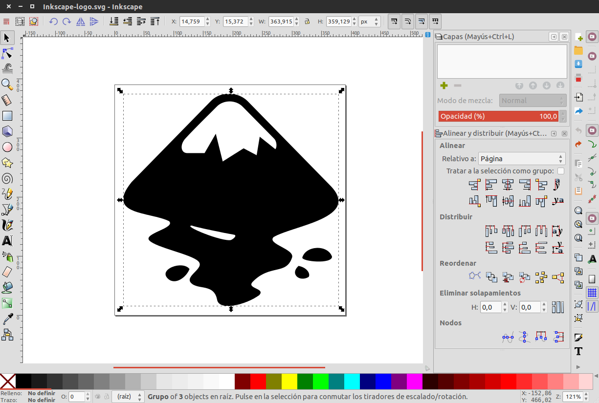

The Pains & the goods
=================================

The main problem for Inkscape newcomers is its usability. Since its born in 2003 Inkscape has beend actively developed and most of its new functionalities has been added piece-meal over the years without much thought about consistency.

What are the pains :(
-----------------------

**Order and hierarchy**
    Inkscape has a lot of non key features at plain sight and at the same level of the basic ones and the basic ones are not set in an specific order.

**Workflow**
    There is no consistency in the user flow and some newcomers get lost using the application.

**Visual Design**
    There is room for improvements on visual design.

What we love :)
--------------------------

**Inkscape is powerful**
    In terms of features Inkscape could be used as a professional vector software editor without much trouble. That makes inkscape not only a serious competitor but also a perfect alternative for those who work with propietary software.

**Complies with vector image standards**
    The goal of inscape is to provide a tool that accomplish completely with international standards for XML, SVG and CSS.

**Powerful shortcuts systems**
    Most of the tool can be used via its powerful shortcut system. In addition, the shortcut system is customizable and inkscape provides a preconfigured shortcut system similar to alternative propietary software.

**It's OPEN SOURCE!**
    Unlike many proprietary applications you can directly report issues, enhancements or features to the Inkscape developers or develop it yourself if you have the knowledge to do it. Inkscape is developed by people like us and we can be part of it.

A big insight
--------------

**Most designers think that inkscape has none of this features**
    While we agree that Inkscape is powerful and flexible, we found out that most of the designers still using propietary software (paying it or hacking it) because they think that Inkscape is not stable and professional for theis current job. And surprisignly, **most of them agreed that the lack of confidence in open source software as inkscape was caused by its interface and poor usability.**
