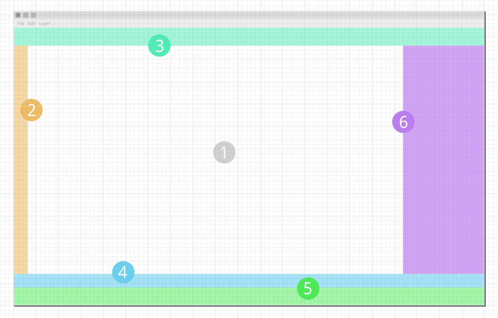

Structure
=================================

The inkscape current layout structure a bit chaotic. Grouping the type of content and functionalities provided to the user will greatly facilitate his tasks. Defining areas can facilitate the user recognizing what he need without using his memory. We’ll discriminate between tools, subtools, panels and info. You can read more about *recognition rather than recall:* http://www.nngroup.com/articles/recognition-and-recall/ .

Our goal is to define different action areas so it could help not only at organizing the current content and features but at providing a recognizable pattern for the user. This pattern should also facilitate the developers the decision making about where to place new features.

#. **Work Space**: This is the main area. It should be big enough for the designer and keep its space as big as possible.
#. **Tool Bar**: This is where the tools are.
#. **Settings bar**: This is where the settings are.
#. **Colors Palette**: This is where there the colors palettes are.
#. **Info Bar**: This is where the information bar is.
#. **Panels Zone**: This is where the dockers panels are.
